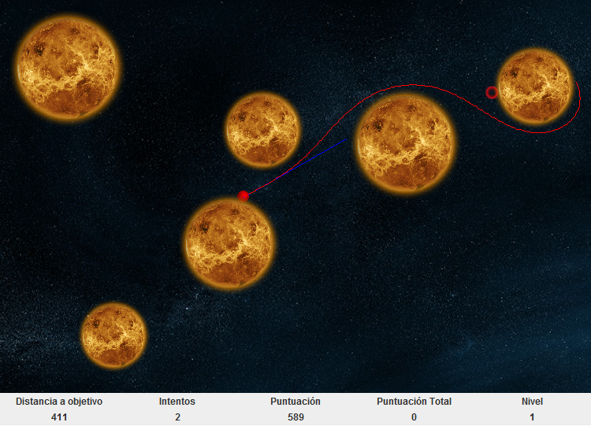

# Disclaimer

Please note that the source code for this project dates back to 2013. This project represents my journey into Java programming, my first incursion into OOP. At the time of its creation, I was unfamiliar with Git and the practices of version control and open-source sharing, which is why the decision to upload the source code to GitHub came significantly later.

What follows is a brief description of the game and an overview of the genetic algorithm used for content generation of the game levels (the main topic of the master's project). For a comprehensive understanding, you can find the complete project documentation in the file `TFMisiaAlejandroGutierrez.pdf` within the repository. Please be aware that this document is in Spanish. Thank you for understanding the context and history behind this project's development and release.

# Project Overview

This project contains the source code of my 2013 MSc in Software Engineering and Artificial Intelligence final project, which introduces a unique video game that melds some principles of physics with an engaging gameplay, built entirely from scratch in Java. At its core, the game simulates a 2-dimensional n-body problem, set in a universe where planets are stationary and immune to mutual gravitational attraction. However, the twist comes with the introduction of a controllable particle.

## Game Mechanics

### Setting and Objective
Each planet exerts its own gravitational force, but unlike traditional n-body simulations, these bodies do not attract each other or move. The game's focal point is a singular particle placed on a planet's surface.

The primary objective is simple yet challenging: guide the particle across space to land on a designated target located on another planet's surface. This target represents the hole in our space-themed golf game, with the universe as the course.

### Gameplay Dynamics
To achieve this players must define a force vector (both direction and magnitude) to propel the particle into space, aiming to escape the host planet's gravitational pull. The journey through space is governed by the gravitational forces exerted by all surrounding planets, adding layers of strategy and challenge to each shot.

#### Inelastic Collisions
A key gameplay element is the incorporation of inelastic collisions, simulating a realistic scenario where the particle loses a portion of its velocity upon colliding with planetary surfaces. This mechanic not only adds depth to the strategy: to successfully land on the desired planet, players may use the technique of glancing blows, hitting the planet tangentially to induce multiple, velocity-reducing collisions.

### Development Highlights
- **Custom Physics Engine**: Built entirely without the use of game development libraries. Every aspect, from gravitational pull calculations to collision dynamics, was programmed from scratch, as I wanted to learn the basics of basics of game physics, collision detection, and the mathematical underpinnings of simulations. 

## Automatic Content Generation Overview

This project introduces a sophisticated automatic content generation system, leveraging a genetic algorithm to create dynamic and challenging levels for players. Warning: this section is generated by chatGPT from my beamer slides. For a comprehensive understanding, I refer you once again to the document `TFMisiaAlejandroGutierrez.pdf` (in Spanish).

### Algorithm Design
The process begins with the initialization of a population, followed by a loop that continues for up to 2 times the maximum number of iterations, performing several key operations:
1. **Selection**: Two distinct individuals are selected through binary tournament selection.
2. **Crossover**: Individuals undergo crossover at a certain rate, blending their features to produce offspring.
3. **Mutation**: The offspring may mutate, with specific probabilities affecting various aspects of their genetic makeup.
4. **Insertion**: Newly created individuals are inserted into the structured population.
5. **Evaluation**: The entire population undergoes a global evaluation to assess fitness and adaptability.

### Crossover and Mutation
- **Crossover** involves the combination of genetic material from two 'parent' configurations to create 'children', enriching the diversity and potential of the population.
- **Mutation** adjusts individual genes (representing planet position, mass, and particle attributes) with specified probabilities, ensuring variability and the introduction of new traits. This includes altering planet characteristics based on a normal distribution and particle/target genes according to a uniform distribution within their respective ranges.

### Fitness Functions
Three fitness functions evaluate the suitability of generated content:
1. **Intersections**: Measures the 'distance' between the particle and the target planet, considering the interferences by intermediate planets.
2. **Minimizing Attraction at the Target**: Assesses the total acceleration vector around the target planet, aiming to minimize gravitational pull that could deviate the particle.
3. **Based on Direct Simulation**: Evaluates the difficulty of reaching the target with a first shot by simulating launches with various velocity vectors and calculating a difficulty score based on distance and the number of collisions.

